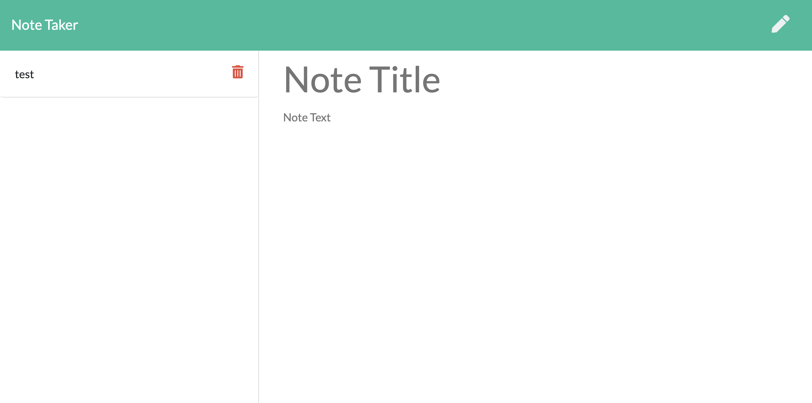

# NoteTaker

## Description

This application can be used to write, save, and delete notes. This application uses an express backend to save and retrieve note data from a JSON file. 

## Installation

The following npm module packages were used to create this application:
* npm path
* npm express

## Usage

As a user, you will be able to write and save notes, delete notes you've written before,and organize your thoughts and keep track of tasks you need to complete. 

## Screenshots

## Deployment

This app is deployed to heroku. https://note-taker-armin.herokuapp.com/
